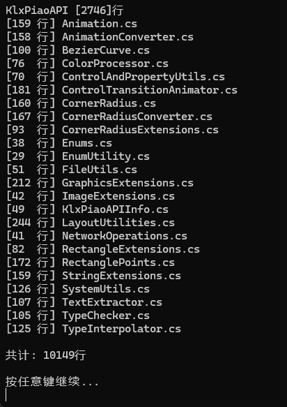

# VBCSharpLineCounter

实现 VB/C#.NET 代码行数统计的解决方案

## 使用

解决方案提供了两个项目（命令行版本 和 GUI 版本），可以在 [releases](https://github.com/miniyu157/LineCounter/releases) 页面下载

## 原理
解析 .sln 文件，遍历项目文件夹中的文件并统计行数 (自动排除 .Designer 文件)

其中，```string.ExtractAllBetween``` 方法是通过 [KlxPiaoAPI.TextExtractor](https://github.com/miniyu157/KlxPiao/blob/master/KlxPiaoAPI/TextExtractor.cs)  实现的


## 预览


